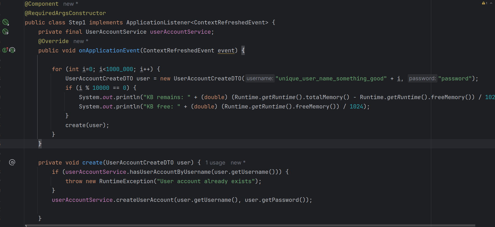

# Задание 
## Описание/Пошаговая инструкция выполнения домашнего задания:

* Реализовать простое приложение на spring boot:

* Сервис регистрации пользователя в системе: rest service принимающий login и password от пользователя

* Для хранения данных использовать БД H2
* Для доступа к данным использовать Spring JPA

* Заложить проблему, вызывающую OutOfMemoryError. Примечание: приложение должно постепенно копить мусор в течение нескольких минут

* Запускать приложение с инструкцией, позволяющей собирать дамп хипа перед падением

* Провести анализ дампа инструментам Eclipse Memory Analyzer Tool, найти утечку, и предоставить скиншот того места, где можно сделать вывод об утечку (с комментариями, поясняющими почему вы считаете это место утечкой)

* Поправить утечку памяти (отдельным коммитом в пулл реквесте).

# Решение
# Решение. Часть один - поиск причин
* Пишем приложение с OOM
* Запускаем с параметрами 
  * -Xmx70m
  * -XX:+HeapDumpOnOutOfMemoryError
  * -XX:HeapDumpPath=/home/dk/work/temp/oomdump2.hprof
  * -Xlog:gc*
  * -Xloggc:/home/dk/work/temp/gc.log
* Наблюдаем картину 
* Открываем дамп памяти с MAT, dominator tree, видим самый большой объект: 
* Открываем его и видим полмиллиона значений 
* Открываем узлы структуры данных и смотрим что в значениях  Понимаем, что это имена пользователей
* Ищем, кто использует кэш в системе и по именам пользователей 
* Ищем, кто использует код, что использует кэш. Выходим на стартовую процедуру заполнения данных. 
* Видим, что по плану у нас должно быть миллион значений. Так что мы не можем просто увеличить память. Вдруг захочется добавить еще значений. 

# Решение. Часть два. Что делать?
Вывод один - ограничиваем аппетиты. Ставим ограничение на количество элементов в кэше. 
SimpleCache что мы использовали ранее основан на ConcurrentHashMap, поэтому придется подключить библиотеку кэширования Caffeine.
После этого ограничим количество записей в кэше: spring.cache.caffeine.spec=maximumSize=10000,expireAfterWrite=60s
Если бы у нас было несколько кэшей то мы бы ограничивали по другому.
Запускаем приложение - и память больше не забивается! Шаг обновления успешно доходит до конца. 

